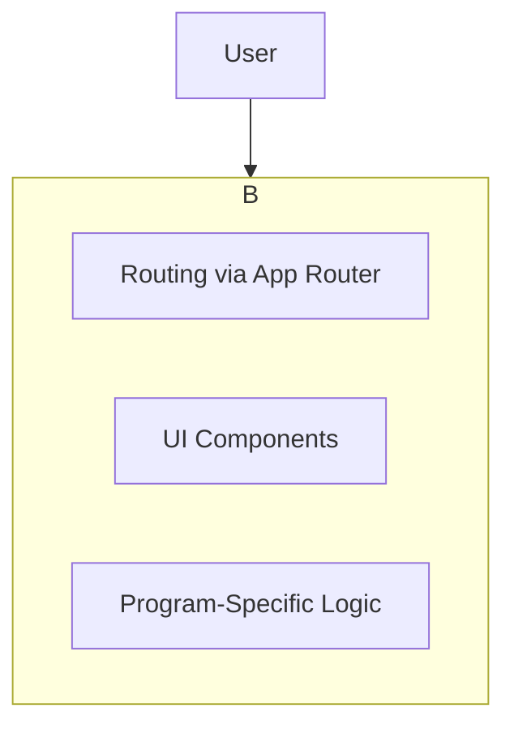

# High-Level Architecture Overview

To understand how to contribute effectively, it's crucial to grasp the core architectural decisions behind this project. We've optimized for a clean separation of concerns within a single, unified application.

### The "Shopping Mall" Architecture

This project is a single **Next.js application** that serves all three programs. This creates a unified user experience under one domain while keeping our technology stack lean and focused.

**Analogy:** Think of our website as a **shopping mall**.

* The main URL is the **mall entrance**.
* Our Next.js application is the **entire mall building**. It contains the main entrance hall (the landing page) and the directory (the App Router).
* Each program (`/passaporte`, `/futuro`, `/ia`) is a **store within the mall**. The router directs visitors to the correct store based on the URL.

This approach means we only have one application to build, deploy, and maintain, while still allowing each "store" to have a unique brand identity and set of features.

### System Diagram

This diagram shows the simplified structure of our application.

